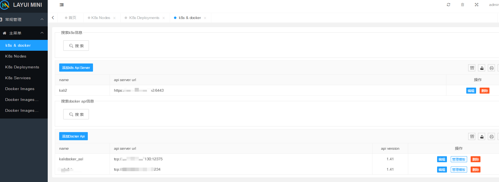

# k8s-web-knife

模仿一些云服务商管理k8s的界面,可用于`k8s` + `docker`开发环境下部署测试项目

需要添加 k8s 和docker api的相关配置才可使用

测试环境

- k8s  1.25.5
- docker docker-20.10.17
- cri-docker 0.3.1

- 默认账号密码 `kwk` `kwk`
- web终端 https://github.com/ica10888/k8s-terminal

> https://docs.docker.com/engine/api/#authentication



```shell
kubectl api-versions


admissionregistration.k8s.io/v1
apiextensions.k8s.io/v1
apiregistration.k8s.io/v1
apps/v1
authentication.k8s.io/v1
authorization.k8s.io/v1
autoscaling/v1
autoscaling/v2
autoscaling/v2beta2
batch/v1
certificates.k8s.io/v1
coordination.k8s.io/v1
discovery.k8s.io/v1
events.k8s.io/v1
flowcontrol.apiserver.k8s.io/v1beta1
flowcontrol.apiserver.k8s.io/v1beta2
networking.k8s.io/v1
node.k8s.io/v1
policy/v1
rbac.authorization.k8s.io/v1
scheduling.k8s.io/v1
storage.k8s.io/v1
storage.k8s.io/v1beta1
v1

```

https://www.cnblogs.com/wuchangblog/p/16593137.html

```shell
kubectl get --raw /

{
  "paths": [
    "/.well-known/openid-configuration",
    "/api",
    "/api/v1",
    "/apis",
    "/apis/",
    "/apis/admissionregistration.k8s.io",
    "/apis/admissionregistration.k8s.io/v1",
    "/apis/apiextensions.k8s.io",
    "/apis/apiextensions.k8s.io/v1",
    "/apis/apiregistration.k8s.io",
    "/apis/apiregistration.k8s.io/v1",
    "/apis/apps",
    "/apis/apps/v1",
    "/apis/authentication.k8s.io",
    "/apis/authentication.k8s.io/v1",
    "/apis/authorization.k8s.io",
    "/apis/authorization.k8s.io/v1",
    "/apis/autoscaling",
    "/apis/autoscaling/v1",
    "/apis/autoscaling/v2",
    "/apis/autoscaling/v2beta2",
    "/apis/batch",
    "/apis/batch/v1",
    "/apis/certificates.k8s.io",
    "/apis/certificates.k8s.io/v1",
    "/apis/coordination.k8s.io",
    "/apis/coordination.k8s.io/v1",
    "/apis/discovery.k8s.io",
    "/apis/discovery.k8s.io/v1",
    "/apis/events.k8s.io",
    "/apis/events.k8s.io/v1",
    "/apis/flowcontrol.apiserver.k8s.io",
    "/apis/flowcontrol.apiserver.k8s.io/v1beta1",
    "/apis/flowcontrol.apiserver.k8s.io/v1beta2",
    "/apis/networking.k8s.io",
    "/apis/networking.k8s.io/v1",
    "/apis/node.k8s.io",
    "/apis/node.k8s.io/v1",
    "/apis/policy",
    "/apis/policy/v1",
    "/apis/rbac.authorization.k8s.io",
    "/apis/rbac.authorization.k8s.io/v1",
    "/apis/scheduling.k8s.io",
    "/apis/scheduling.k8s.io/v1",
    "/apis/storage.k8s.io",
    "/apis/storage.k8s.io/v1",
    "/apis/storage.k8s.io/v1beta1",
    "/healthz",
    "/healthz/autoregister-completion",
    "/healthz/etcd",
    "/healthz/log",
    "/healthz/ping",
    "/healthz/poststarthook/aggregator-reload-proxy-client-cert",
    "/healthz/poststarthook/apiservice-openapi-controller",
    "/healthz/poststarthook/apiservice-openapiv3-controller",
    "/healthz/poststarthook/apiservice-registration-controller",
    "/healthz/poststarthook/apiservice-status-available-controller",
    "/healthz/poststarthook/bootstrap-controller",
    "/healthz/poststarthook/crd-informer-synced",
    "/healthz/poststarthook/generic-apiserver-start-informers",
    "/healthz/poststarthook/kube-apiserver-autoregistration",
    "/healthz/poststarthook/priority-and-fairness-config-consumer",
    "/healthz/poststarthook/priority-and-fairness-config-producer",
    "/healthz/poststarthook/priority-and-fairness-filter",
    "/healthz/poststarthook/rbac/bootstrap-roles",
    "/healthz/poststarthook/scheduling/bootstrap-system-priority-classes",
    "/healthz/poststarthook/start-apiextensions-controllers",
    "/healthz/poststarthook/start-apiextensions-informers",
    "/healthz/poststarthook/start-cluster-authentication-info-controller",
    "/healthz/poststarthook/start-kube-aggregator-informers",
    "/healthz/poststarthook/start-kube-apiserver-admission-initializer",
    "/healthz/poststarthook/storage-object-count-tracker-hook",
    "/livez",
    "/livez/autoregister-completion",
    "/livez/etcd",
    "/livez/log",
    "/livez/ping",
    "/livez/poststarthook/aggregator-reload-proxy-client-cert",
    "/livez/poststarthook/apiservice-openapi-controller",
    "/livez/poststarthook/apiservice-openapiv3-controller",
    "/livez/poststarthook/apiservice-registration-controller",
    "/livez/poststarthook/apiservice-status-available-controller",
    "/livez/poststarthook/bootstrap-controller",
    "/livez/poststarthook/crd-informer-synced",
    "/livez/poststarthook/generic-apiserver-start-informers",
    "/livez/poststarthook/kube-apiserver-autoregistration",
    "/livez/poststarthook/priority-and-fairness-config-consumer",
    "/livez/poststarthook/priority-and-fairness-config-producer",
    "/livez/poststarthook/priority-and-fairness-filter",
    "/livez/poststarthook/rbac/bootstrap-roles",
    "/livez/poststarthook/scheduling/bootstrap-system-priority-classes",
    "/livez/poststarthook/start-apiextensions-controllers",
    "/livez/poststarthook/start-apiextensions-informers",
    "/livez/poststarthook/start-cluster-authentication-info-controller",
    "/livez/poststarthook/start-kube-aggregator-informers",
    "/livez/poststarthook/start-kube-apiserver-admission-initializer",
    "/livez/poststarthook/storage-object-count-tracker-hook",
    "/logs",
    "/metrics",
    "/openapi/v2",
    "/openapi/v3",
    "/openapi/v3/",
    "/openid/v1/jwks",
    "/readyz",
    "/readyz/autoregister-completion",
    "/readyz/etcd",
    "/readyz/etcd-readiness",
    "/readyz/informer-sync",
    "/readyz/log",
    "/readyz/ping",
    "/readyz/poststarthook/aggregator-reload-proxy-client-cert",
    "/readyz/poststarthook/apiservice-openapi-controller",
    "/readyz/poststarthook/apiservice-openapiv3-controller",
    "/readyz/poststarthook/apiservice-registration-controller",
    "/readyz/poststarthook/apiservice-status-available-controller",
    "/readyz/poststarthook/bootstrap-controller",
    "/readyz/poststarthook/crd-informer-synced",
    "/readyz/poststarthook/generic-apiserver-start-informers",
    "/readyz/poststarthook/kube-apiserver-autoregistration",
    "/readyz/poststarthook/priority-and-fairness-config-consumer",
    "/readyz/poststarthook/priority-and-fairness-config-producer",
    "/readyz/poststarthook/priority-and-fairness-filter",
    "/readyz/poststarthook/rbac/bootstrap-roles",
    "/readyz/poststarthook/scheduling/bootstrap-system-priority-classes",
    "/readyz/poststarthook/start-apiextensions-controllers",
    "/readyz/poststarthook/start-apiextensions-informers",
    "/readyz/poststarthook/start-cluster-authentication-info-controller",
    "/readyz/poststarthook/start-kube-aggregator-informers",
    "/readyz/poststarthook/start-kube-apiserver-admission-initializer",
    "/readyz/poststarthook/storage-object-count-tracker-hook",
    "/readyz/shutdown",
    "/version"
  ]
}       
```

```shell
# kubectl get --raw /apis/batch/v1 | python -m json.tool
{
    "kind": "APIResourceList",
    "apiVersion": "v1",
    "groupVersion": "batch/v1",
    "resources": [
        {
            "name": "cronjobs",
            "singularName": "",
            "namespaced": true,
            "kind": "CronJob",
            "verbs": [
                "create",
                "delete",
                "deletecollection",
                "get",
                "list",
                "patch",
                "update",
                "watch"
            ],
            "shortNames": [
                "cj"
            ],
            "categories": [
                "all"
            ],
            "storageVersionHash": "sd5LIXh4Fjs="
        },
        {
            "name": "cronjobs/status",
            "singularName": "",
            "namespaced": true,
            "kind": "CronJob",
            "verbs": [
                "get",
                "patch",
                "update"
            ]
        },
        {
            "name": "jobs",
            "singularName": "",
            "namespaced": true,
            "kind": "Job",
            "verbs": [
                "create",
                "delete",
                "deletecollection",
                "get",
                "list",
                "patch",
                "update",
                "watch"
            ],
            "categories": [
                "all"
            ],
            "storageVersionHash": "mudhfqk/qZY="
        },
        {
            "name": "jobs/status",
            "singularName": "",
            "namespaced": true,
            "kind": "Job",
            "verbs": [
                "get",
                "patch",
                "update"
            ]
        }
    ]
}


```
